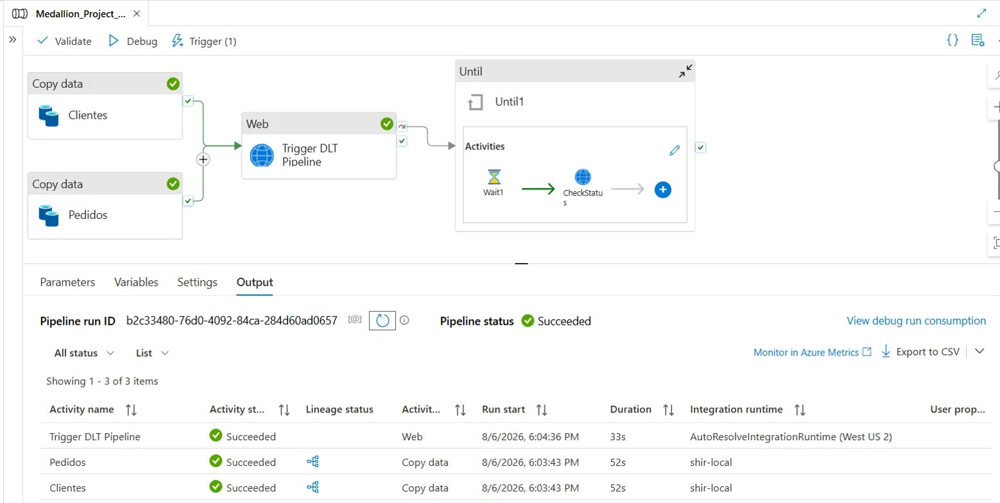

# AzureDatabricksMedallion

End-to-end Medallion Architecture (Bronze -> Silver -> Gold) implementation using MySQL as the source system, Azure Synapse Analytics for orchestration and ingestion, Databricks (Delta Live Tables and Unity Catalog) for the Bronze layer, and dbt for Silver and Gold transformations, fully deployed and tested through Databricks Asset Bundles and GitHub Actions CI/CD.

The pipeline intentionally ingests data with realistic quality issues (nulls, duplicates, orphaned foreign keys, inconsistent formats, invalid dates) instead of a pre-cleaned dataset, so that the Silver layer has to perform real validation and cleansing work, matching what happens with production source systems.

```
MySQL (source) -> Azure Synapse (extraction + orchestration) -> ADLS Gen2 (raw)
   -> Databricks Delta Live Tables (Bronze) -> dbt on Databricks (Silver, Gold) -> Power BI
```

---

## Purpose

Customer and order data coming from operational systems is rarely clean: duplicate customer records under different emails, orders referencing customers that no longer exist, inconsistent date formats, and fields that arrive as free text instead of validated numbers. Left unhandled, these issues silently corrupt downstream reporting: revenue gets double-counted, customer counts get inflated, and dashboards quietly become unreliable without anyone noticing until a stakeholder questions a number.

This project builds a pipeline designed around that reality instead of around a pre-cleaned dataset, to demonstrate:

- **Data quality enforcement as a first-class layer**, not an afterthought: every transformation from Bronze to Gold either resolves a specific data quality problem (deduplication, orphaned foreign keys, invalid types) or explicitly flags it for visibility, backed by automated dbt tests that fail the build when a rule is violated.
- **A production-style CI/CD setup**, not a notebook run manually before a demo: every pull request deploys to an isolated dev environment and runs the full pipeline end to end, including all data quality tests, before code is allowed into `main`; production deployment is a separate, automated step triggered only after that validation passes.
- **Environment isolation done through configuration, not duplication**: dev and prod share the exact same pipeline and job definitions, differing only through Databricks Asset Bundle variables, which is the same approach used to safely promote changes in a real multi-environment setup.

---

## Architecture

### Orchestration pipeline (Azure Synapse)

The Synapse pipeline `Medallion_Project_Databricks_dbt` handles extraction from the source system and triggers downstream processing in Databricks.



**1. Copy Data (Clientes, Pedidos) - run in parallel**
Two Copy Data activities extract the `clientes` and `pedidos` tables from MySQL and land them as Parquet files in the `raw` container of ADLS Gen2. Both activities reuse the same pair of parameterized datasets instead of hardcoding one dataset per table:

- **Source dataset (`MySqlTable1`)**: exposes a `nombre_tabla_origen` string parameter, used to resolve the source table dynamically:
  ```
  Table = @dataset().nombre_tabla_origen
  ```
- **Sink dataset (`Parquet1`)**: exposes a `nombre_tabla` string parameter, used to build both the destination folder and a unique, timestamped file name per run:
  ```
  File path   = raw / @concat(dataset().nombre_tabla, '_bronze')
                     / @concat(dataset().nombre_tabla, '_', utcnow('yyyyMMddHHmmss'), '.parquet')
  Compression = snappy
  ```

Each Copy Data activity only supplies a different value for these two parameters at the activity level (`"clientes"` or `"pedidos"`), so both extractions share the exact same logic.

**Why the file name is built this way:**
- `concat(dataset().nombre_tabla, ...)` groups both current and historical extractions of the same table under a single, predictable folder (`clientes_bronze`, `pedidos_bronze`), which is what the Bronze DLT notebook points Auto Loader at.
- `utcnow('yyyyMMddHHmmss')` guarantees a unique file name on every pipeline run. Without it, every execution would write to the exact same path and overwrite the previous file, which would silently discard the previous batch instead of accumulating history.
- Appending the literal `.parquet` extension explicitly matters beyond readability: file format detection downstream (Auto Loader, and any catalog/governance tool that reads the raw layer) infers the schema and applies classification based on the file extension. A file written without it is treated as an unrecognized binary blob, its schema is never inferred, and it silently produces an empty result instead of failing loudly.

**2. Web Activity - Trigger DLT Pipeline**
Once both Copy Data activities succeed, a Web activity calls the Databricks REST API to start the `bronze_medallion_bundle` Delta Live Tables pipeline. This call is asynchronous: Databricks accepts the trigger and returns immediately, it does not wait for the pipeline to finish.

**3. Until loop (Wait1 -> CheckStatus)**
Because the trigger call is fire-and-forget and Synapse has no native activity to block until a Databricks run completes, the `Until` container implements manual polling.

- `CheckStatus` is a Web activity that calls the Databricks Jobs API to read the current run state, authenticated via System-assigned Managed Identity against the Databricks resource (no token stored in the pipeline):
  ```
  GET https://adb-7405611969133544.4.azuredatabricks.net/api/2.1/jobs/runs/get?run_id=@{activity('Trigger DLT Pipeline').output.run_id}
  ```
  The `run_id` is taken directly from the output of the `Trigger DLT Pipeline` activity, so the loop always polls the exact run it just started, not a hardcoded or previous one.
- `Wait1` pauses between each poll to avoid hammering the API with requests.
- The `Until` container's break condition evaluates the polled `life_cycle_state` and exits the loop as soon as the run reaches either terminal state:
  ```
  @or(
    equals(activity('CheckStatus').output.state.life_cycle_state, 'TERMINATED'),
    equals(activity('CheckStatus').output.state.life_cycle_state, 'INTERNAL_ERROR')
  )
  ```
  A timeout is also configured on the `Until` activity itself, so the pipeline does not poll indefinitely if Databricks never reaches a terminal state.

This is what allows the orchestration layer to know the real outcome of the downstream processing instead of assuming success right after the trigger call returns.

### Bronze layer (Databricks Delta Live Tables)

`notebooks/bronze_medallion_dlt.py` defines two streaming DLT tables, `clientes` and `pedidos`, that read the Parquet files produced by Synapse using Auto Loader (`cloudFiles`). Auto Loader was chosen over a batch read so that new files landing in `raw/clientes_bronze` and `raw/pedidos_bronze` are picked up incrementally, tracking schema evolution through a dedicated schema location per table (`_schemas/clientes`, `_schemas/pedidos`). This produces the managed Bronze tables inside Unity Catalog (`medallion_lakehouse.bronze`), which are the source for dbt.

### Silver layer (dbt)

The Silver models (`stg_clientes`, `stg_pedidos`) read directly from the Bronze tables through `sources.yml` and are responsible for:

- **Deduplication**: a `DISTINCT` pass removes exact duplicate rows coming from Bronze.
- **Type casting**: `try_cast` is used on `cantidad`, `precio_unitario` and the date columns, since Bronze stores them as strings on purpose (to simulate an unvalidated source). Rows that fail to cast become `null` instead of breaking the pipeline.
- **Business-key deduplication**: in `stg_clientes`, a `row_number()` window over `email` keeps only the most recent record per email, resolving cases where the same customer was ingested more than once with different attributes.
- **Data quality flags instead of deletion**: in `stg_pedidos`, invalid rows (non-positive quantity, non-positive price, future order dates) are not dropped. They are flagged with boolean columns (`flag_cantidad_invalida`, `flag_precio_invalido`, `flag_fecha_futura`) so that downstream models can decide whether to include or exclude them, and so that data quality issues remain visible instead of being silently discarded.

### Gold layer (dbt)

- **`dim_clientes`**: one row per customer, built from `stg_clientes`, adding a derived `dias_como_cliente` (days since registration) metric.
- **`fct_pedidos`**: the order fact table, joining `stg_pedidos` with `dim_clientes` to bring in `ciudad`, calculating `monto_total` (`cantidad * precio_unitario`), and explicitly filtering out rows previously flagged as invalid in Silver. This is where the quality flags from Silver are finally acted upon.
- **`mart_ventas_por_ciudad`**: an aggregated mart on top of `fct_pedidos`, grouped by city and product, exposing `total_pedidos`, `unidades_vendidas`, `ingresos_totales` and `ticket_promedio` for direct BI consumption.

---

## Data quality testing (dbt)

Tests are defined per layer in `schema.yml`, using both dbt core tests and `dbt_utils`:

| Layer | Model | Column | Test |
|---|---|---|---|
| Silver | stg_clientes | cliente_id | not_null |
| Silver | stg_clientes | email | not_null |
| Silver | stg_pedidos | pedido_id | not_null |
| Silver | stg_pedidos | cliente_id | relationships to stg_clientes.cliente_id (severity: warn) |
| Gold | dim_clientes | cliente_id | unique, not_null |
| Gold | fct_pedidos | pedido_id | unique, not_null |
| Gold | fct_pedidos | monto_total | dbt_utils.accepted_range (min 0, inclusive) |
| Gold | mart_ventas_por_ciudad | ingresos_totales | dbt_utils.accepted_range (min 0) |

The `relationships` test on `stg_pedidos.cliente_id` is set to `severity: warn` rather than `error` on purpose: orphaned foreign keys are an expected, intentionally generated data quality issue at Bronze, and the pipeline should surface them without failing the whole build, since the same rows are still evaluated further downstream through the quality flags in Silver.

---

## Deployment: Databricks Asset Bundle

The entire Databricks configuration (pipeline, job, schedule, variables) is defined declaratively in `databricks.yml` and `resources/medallion.yml`, deployed through the Databricks CLI (`databricks bundle deploy`).

**Variables**: `catalog`, `bronze_schema`, `silver_schema`, `gold_schema` and `pipeline_development` are defined once and overridden per target, so the same bundle definition produces isolated dev and prod environments without duplicating pipeline or job logic.

**Targets**:
- `dev` (default): points bronze/silver/gold to `_dev`-suffixed schemas and runs the DLT pipeline in development mode (faster iteration, no production data).
- `prod`: points to the production schemas and deploys under a dedicated workspace root path scoped to the service user.

**Resources**:
- `bronze_medallion_bundle` (DLT pipeline): serverless, reads `notebooks/bronze_medallion_dlt.py`, with its `development` flag driven by the `pipeline_development` variable so the same definition behaves differently per target without manual edits.
- `medallion_full_pipeline` (job): two dependent tasks, `run_bronze` (executes the DLT pipeline) followed by `run_dbt` (executes `dbt deps` and `dbt build`, passing the schema variables through `--vars` so dbt resolves the correct dev/prod schemas). It runs on a serverless environment with `dbt-core` and `dbt-databricks` as declared dependencies, uses a fixed SQL warehouse for the dbt task, is scheduled through a quartz cron expression, and sends email notifications on both success and failure.

---

## CI/CD (GitHub Actions)

Two workflows separate validation from deployment, each authenticating against a different Databricks token stored as a GitHub Secret (`DATABRICKS_TOKEN_DEV`, `DATABRICKS_TOKEN_PROD`), so dev testing can never touch production credentials.

**CI - Validate in dev** (`ci.yml`), triggered on every pull request targeting `main`:
1. Checks out the code and installs the Databricks CLI.
2. Deploys the bundle to the `dev` target.
3. Runs the actual `medallion_full_pipeline` job in dev end-to-end (Bronze DLT pipeline followed by the full dbt build, including all tests above). This validates the real pipeline behavior on every PR, not just that the code parses, so a broken model or a failing test blocks the merge.
4. Posts a Slack notification if any step fails, tagging the PR number and title.

**CD - Deploy to production** (`cd.yml`), triggered on every push to `main` (i.e., right after a PR is merged):
1. Deploys the bundle to the `prod` target using the production token.
2. This step only updates the pipeline and job definitions in the production workspace, it does not execute them. Production runs happen through the job's own scheduled trigger, keeping deployment and execution decoupled.
3. Posts a Slack notification on success or failure of the deploy step.

---

## Source data generation

`scripts/generate_dirty_data.py` populates the MySQL source tables (`clientes`, `pedidos` in `medallion_bronze`), created without primary or foreign key constraints on purpose, to allow invalid references to actually be inserted. Each execution appends a new batch (`_batch_id`, `_inserted_at`), simulating a day of ingestion, with a mix of approximately 80 percent valid records and 20 percent records with deliberate issues: nulls, exact duplicates, business-level duplicates, orphaned foreign keys, invalid dates and corrupted values in numeric columns. Date and numeric columns are stored as strings at this stage to mimic an unvalidated upstream source, which is what forces the explicit casting logic in the Silver layer.

---

## Repository structure

```
.
|-- .github/workflows/       CI and CD GitHub Actions workflows
|-- medallion_dbt/           dbt project: staging (Silver) and marts (Gold) models, tests, sources
|-- notebooks/                Databricks DLT notebook for the Bronze layer
|-- resources/                Databricks Asset Bundle resource definitions (pipeline, job)
|-- scripts/                  Source data generator (MySQL)
|-- databricks.yml            Bundle configuration: variables and targets (dev/prod)
`-- CLAUDE.md                 Internal development notes: status, roadmap, conventions
```

---

## Tech stack

Python, MySQL, Azure Synapse Analytics, Azure Data Lake Storage Gen2, Databricks, Delta Live Tables, Unity Catalog, Databricks Asset Bundles, dbt, dbt-utils, GitHub Actions, Power BI

---

## Author

David Cordova - Data Engineer (Databricks, Azure, AWS, Python, dbt)
[LinkedIn](https://www.linkedin.com/in/david-c%C3%B3rdova-4788838a/)
